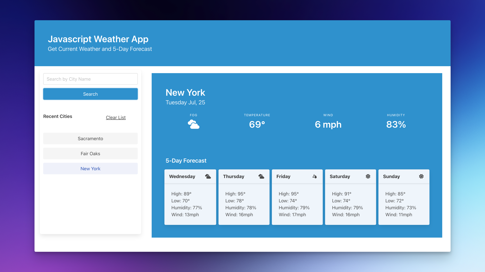

# Javascript Weather App
## User Story
`AS` A traveler 
`I WANT` to see the weather outlook for multiple cities 
`SO THAT` I can plan a trip accordingly 

## Acceptance Criteria
`GIVEN` a weather dashboard with form inputs  
`WHEN` I search for a city 
`THEN` I am presented with current and future conditions for that city and that city is added to the search history 
`WHEN` I view current weather conditions for that city 
`THEN` I am presented with the city name, the date, an icon representation of weather conditions, the temperature, the humidity, and the the wind speed 
`WHEN` I view future weather conditions for that city 
`THEN` I am presented with a 5-day forecast that displays the date, an icon representation of weather conditions, the temperature, the wind speed, and the humidity 
`WHEN` I click on a city in the search history 
`THEN` I am again presented with current and future conditions for that city 

## Overview
The goal of this project is to create a weather dashboard that runs in the browser and features dynamically updated HTML to display the 5-day weather forecast for various cities. It utilizes the 5 Day Weather Forecast API provided by OpenWeatherMap to retrieve weather data for different locations. Users can search for cities, which are saved to localStorage so they can be accessed after refresh. 

## Technologies Used
* localStorage
* functions 
* Objects 
* DOM Manipulation 
* Loops 
* Fetch

## Deployment 
I have deployed my Javascript Weather App on the web to make it live and accessible. You can view the weather in any city by following this link: [Javascript Weather App](https://briimcfly.github.io/hottest-day-alive/)

## Reflection
This project has allowed me to apply the core skills I have recently learned and put them into practice. During development, I had the opportunity to deepen my understanding of the localStorage property, fetching data from API's, and Object Arrays . Additionally, I developed a deeper appreciation for for the importance code commenting, and the development principal DRY. (Don't repeat yourself). In the future, I would like to spend more time improving the design of the page.

